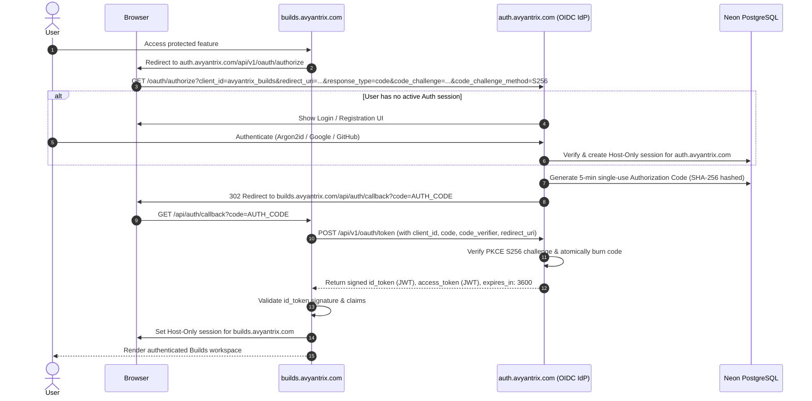

# AVYANTRIX AUTH V1 — ARCHITECTURE SPECIFICATION

**Domain:** `https://auth.avyantrix.com`  
**Deployment Target:** Vercel (Next.js App Router, current stable supported version)  
**Database Authority:** Neon PostgreSQL (Managed Serverless Connection Pooling + Direct Migration Endpoint)  
**Runtime:** Node.js runtime (`runtime = 'nodejs'`) for all authentication, Argon2id, database, and SMTP routes  
**Security Standards:** Argon2id only, Authoritative PostgreSQL Sessions, OpenID Connect Core 1.0 & OAuth 2.0 SSO, Mandatory PKCE S256, Durable Rate Limiting  

---

## 1. System Vision & Product Topology

Avyantrix Auth is the central, authoritative OpenID Connect Identity Provider (IdP) and single sign-on (SSO) hub for the entire Avyantrix ecosystem.

```
                 ┌────────────────────────────────┐
                 │         AVYANTRIX AUTH         │
                 │     (auth.avyantrix.com)       │
                 │   [OpenID Connect Provider]    │
                 └───────────────┬────────────────┘
                                 │
         ┌───────────────────────┼───────────────────────┐
         ▼                       ▼                       ▼
┌──────────────────┐   ┌────────────────────┐   ┌──────────────────┐
│  Avyantrix Builds│   │Avyantrix Challenges│   │   Future Apps    │
│(builds.avyantrix)│   │(challenges.avyantrix)│ │(avyantrix.com/*) │
└──────────────────┘   └────────────────────┘   └──────────────────┘
```

### Architectural Principles
1. **One User → One Avyantrix Account → One Identity:** A single identity provides verified capability standing across all Avyantrix products.
2. **OpenID Connect & OAuth 2.0 with Host-Only Session Isolation:**
   - Central authentication session at `auth.avyantrix.com` is strictly **Host-Only** (`HttpOnly`, `Secure`, `SameSite=Lax`).
   - Downstream applications (`builds.avyantrix.com`, `challenges.avyantrix.com`) NEVER receive or inspect the master Avyantrix session cookie.
   - Downstream apps authenticate via a standard **OIDC Authorization Code Flow** with **mandatory PKCE (`S256`)**.
   - Upon token exchange, Auth issues a signed **`id_token` (JWT)** and **`access_token` (JWT)**.
   - The downstream product verifies the ID Token signature and creates its own isolated, host-only local application session.
3. **Authoritative Neon PostgreSQL:** All user entities, sessions, credentials, roles, and verification records reside authoritatively in Neon PostgreSQL.
4. **Argon2id Only:** Standardized strictly on Argon2id (`m=65536`, `t=3`, `p=1`, `hashLength=32`) exceeding OWASP recommendations.
5. **Durable Distributed Rate Limiting:** Rate limit state is persisted in Neon PostgreSQL (`RateLimitRecord`) ensuring consistent enforcement across serverless instances.

---

## 2. OpenID Connect & OAuth 2.0 Token Contract

### Token Specification
When a downstream application exchanges an authorization code at `POST /api/v1/oauth/token`, Avyantrix Auth responds with an unambiguous OIDC-compliant payload:

```json
{
  "access_token": "<signed_bearer_jwt>",
  "token_type": "Bearer",
  "id_token": "<signed_oidc_id_token_jwt>",
  "expires_in": 3600,
  "scope": "openid profile email"
}
```

### ID Token (JWT) Claims Structure
- **`iss`**: `https://auth.avyantrix.com` (Issuer URL)
- **`sub`**: UUID of the authenticated Avyantrix user
- **`aud`**: Registered `client_id` (e.g. `avyantrix_builds`)
- **`exp`**: Expiration timestamp (1 hour)
- **`iat`**: Issuance timestamp
- **`auth_time`**: Central session authentication timestamp
- **`email`**: User's verified email address
- **`email_verified`**: Boolean
- **`preferred_username`**: Avyantrix unique handle
- **`name`**: Full name
- **`given_name`**: First name
- **`family_name`**: Last name
- **`roles`**: Array of assigned ecosystem roles (`["BUILDER"]`)
- **`permissions`**: Array of effective granular permissions
- **`badges`**: Array of verified capability badges (`[{ "category": "CAPABILITY_BUILDER", "badgeLabel": "Verified Builder" }]`)

### Discovery & UserInfo Endpoints
- **OIDC Discovery:** `GET https://auth.avyantrix.com/.well-known/openid-configuration`
- **OIDC UserInfo:** `GET https://auth.avyantrix.com/api/v1/oauth/userinfo` (Authorized via `Authorization: Bearer <access_token>`)

---

## 3. SSO Authorization Code Flow (Mandatory S256 PKCE)



---

## 4. Database Architecture (Neon PostgreSQL)

### Connection Setup
- **`DATABASE_URL`**: Neon managed connection pooler endpoint (used by serverless API handlers for high-concurrency scaling).
- **`DIRECT_URL`**: Direct unpooled PostgreSQL endpoint (used exclusively by `prisma migrate deploy` for schema migrations).

### Entity Ledger
1. **`users`**: Authoritative account ledger (ID, email, Argon2id hash, status: `ACTIVE`, `SUSPENDED`, `DELETED`).
2. **`user_profiles`**: Public & ecosystem profile (username, firstName, lastName, headline, bio, location, education, links, visibility settings JSON).
3. **`accounts`**: Linked OAuth providers (`GOOGLE`, `GITHUB`, providerAccountId, providerEmail). External provider access tokens are omitted to prevent data leakage.
4. **`sessions`**: Active central sessions for `auth.avyantrix.com` (indexed `token_hash`, IP, user-agent, expiry).
5. **`oauth_clients`**: Registered Avyantrix ecosystem applications (`avyantrix_builds`, `avyantrix_challenges`).
6. **`authorization_codes`**: Single-use, 5-minute TTL authorization codes with SHA-256 indexing and mandatory PKCE S256 verification.
7. **`rate_limit_records`**: Durable table tracking sliding-window request counts across serverless invocations.
8. **`roles`, `permissions`, `role_permissions`, `user_roles`**: Granular RBAC (`BUILDER`, `PROBLEM_OWNER`, `CHALLENGE_ORGANIZER`, `MENTOR`, `ADMIN`).
9. **`skills`, `user_skills`**: Standardized capability taxonomy with proficiency levels (`BEGINNER`, `INTERMEDIATE`, `ADVANCED`, `EXPERT`).
10. **`verification_requests`, `verification_evidence`, `verification_badges`**: V1 capability verification pipeline with structured external references.
11. **`login_events`, `security_events`**: Immutable audit logs capturing all authentication, role grants, and security mutations.
